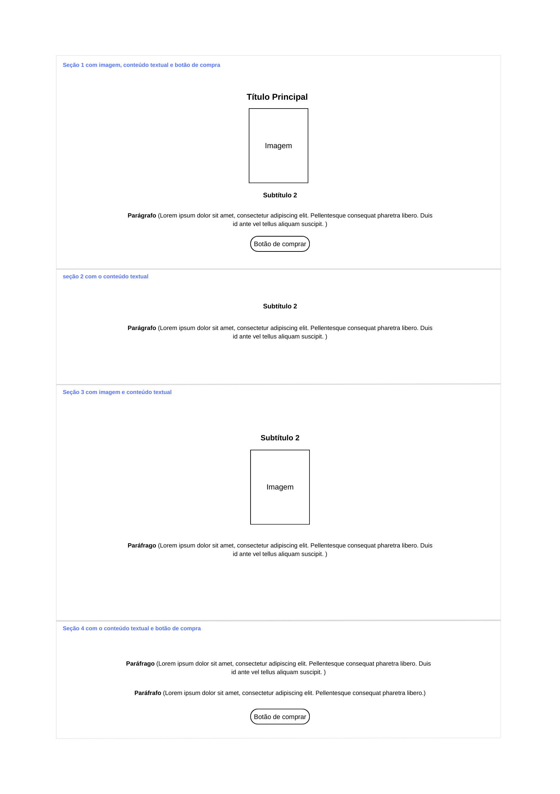

# PROJETO PÁGINA WEB DE UM LIVRO

### Um projeto HTML, CSS sobre o livro do Diego Souza, A Era Artificial para a plataforma Devmedia em parceria com Potência Tech Powered by Ifood.

Para este projeto foi criado um **Wireframe**, um protótipo para sugerir a estrutura do site:

### A página terá a seguinte estrutura:
1. Seção informações sobre o livro;
2. Seção sobre sinopse do livro;
3. Seção informações sobre o autor do livro;
4. Seção marketing do livro.

#

`Informações sobre o livro`:
- Um título;
- Uma imagem (capa do livro);
- Um subtítulo;
- Um parágrafo;
- Um link externo, para a página de venda do livro;

#
`Sinopse do livro`: 
- Um subtítulo;
- Um parágrafo com um .

#
`Informações sobre o autor do livro`:
- Um subtítulo;
- Uma imagem;
- Um parágrafo.

#
`Marketing do livro`:
- Dois parágrafos:
    - Cada um com um ;
- Um link externo, para a página de venda do livro.
